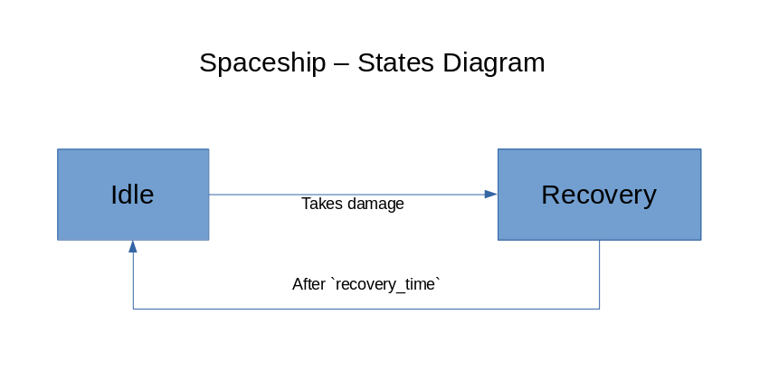

# Game Design Document - Space Shooter

- [Game Design Document - Space Shooter](#game-design-document---space-shooter)
- [Overview](#overview)
- [Story](#story)
- [Gameplay](#gameplay)
- [Mechanics](#mechanics)
  - [Spaceship movement](#spaceship-movement)
  - [Fire bullet (no powerup)](#fire-bullet-no-powerup)
  - [Bullet collision with enemy](#bullet-collision-with-enemy)
  - [Spaceship Life](#spaceship-life)
  - [Gameover](#gameover)
  - [Spaceship - receive damage](#spaceship---receive-damage)
  - [Spawn powerup](#spawn-powerup)
  - [Collect powerup](#collect-powerup)
  - [Fire bullet - Powerup1](#fire-bullet---powerup1)
  - [Enemy spawn](#enemy-spawn)
  - [Enemy receives damage](#enemy-receives-damage)
  - [Enemy defeated](#enemy-defeated)
  - [Enemy 1](#enemy-1)
    - [Spawn](#spawn)
    - [Movement](#movement)
    - [Attack: Fire Bullet](#attack-fire-bullet)
  - [Points](#points)
- [Game Entities Statistics](#game-entities-statistics)
  - [Player spaceship](#player-spaceship)
  - [Bullets damage](#bullets-damage)
  - [Enemy1](#enemy1)

# Overview

Show how skilled you are and survive the waves of incoming spaceships! The more you survive, more points you get!

# Story

War is changed. War is now a mere memory of what it was.

Year 322X. Major cities are now garbage dumps, the scum of the earth rules in every district and the high-ranking citizens live beyond the stratosphere where pollution and crime are miles away in suspended gardens on giants made of steel and concrete.

The "way out", as someone called it, is to join the Military Artificial Combat Simulation program (also known as MACS) to become one of the MAC(the name of the vehicles) pilots who are fighting for the city faction on the WARG, the brutal war simulator that decide the fate of entire populations.

You? Well you are one of them, just joined the program and stuck in the loop that is the final exam, where you need to survive the endless waves of virtual enemies and get the highest rank possible. Who knows what this new life will show to you, time will tell. 

# Gameplay

The gameplay is an infinite side-scrolling shooter where enemies randomly appear and start firing at you.

Your objective is to survive and destroy as much enemies as you can to get points.

# Mechanics

## Spaceship movement

The spaceship can move in all directions (with a joystick or WASD) but it can't go outside the boundary of the screen.

## Fire bullet (no powerup)

If the player presses down or holds the fire key, a bullet will spawn in the spaceship position and will move to the direction it's facing.

## Bullet collision with enemy

If one enemy collides with the bullet:

- the bullet disappears
- the enemy receives a damage (see [Enemy receives damage](#enemy-receives-damage))

## Spaceship Life

The player starts with 3 lives (they need to be always visible during gameplay in the GUI).

If the player loses all the lives, the lose the game.  
See [Gameover](#gameover).

## Gameover

TODO

## Spaceship - receive damage

The player receives damage on:

- enemy collision
- enemy bullet collision

 

If the spaceship is in `Idle` state and it takes damage:

- it loses one life
- it goes immediately into `Recovery` state

When in `Recovery` state:

- the spaceship ignores all the collisions with objects that cause collisions
- the spaceship graphic flashes continuosly (modulation to absolute white)
- a timer is started and after `recovery_time` seconds (eg: 3 seconds), the spaceship transition into the `Idle` state

## Spawn powerup

After an enemy has been killed, it has a x% chance of spawning a powerup.

The powerup slowly moves towards the scrolling direction and disappears (it's destroyed) when it goes out of the screen.

## Collect powerup

The player can collect a powerup simply by touching it.

## Fire bullet - Powerup1

With this powerup, the bullet is larger and deals more damage to enemies.

# Enemies behavior

Here are the behaviors of each type of enemy, which for now will be named "Enemy#" to simplify the development of the following dynamics in the project.

In the diagrams the colors of the lines and symbols are as follows:
- Green Line: Entry Path
- Red Line: Exit path
- Symbol "X": Stop position for X seconds

## Enemy spawn

Enemies can spawn in different ways. The type of spawn depdens on the enemy.

There are different wave movements and formations, randomly selected at the start of each one.

TODO: give more details

## Enemy receives damage

- The enemy sprite flashes to white quickly one time (eg: take a look at Cuphead for reference: https://youtu.be/MivqpCN-AsE?t=108)
- The enemy loses HP the depending on the bullet strenght (see [Bullets damage](#bullets-damage))
- If enemy's HP are less or equalt to 0, the enemy is defeated (see [Enemy defeated](#enemy-defeated))

## Enemy defeated

TODO

## Enemy 1

### Spawn & Movements

### Attack: Fire Bullet

TODO

## Points

- You start with 0 points
- Every 5 seconds you get 10 points for surviving
- Every defeated enemy gives 25 points
- If you don't take any damage for 5 seconds, you get a 2x multiplier for every obtained score
- If you don't take any damage for 10 seconds, you get a 4x multiplier for every obtained score
- If you don't take any damage for 30 seconds, you get a 5x multiplier for every obtained score
  
# Game Entities Statistics

## Player spaceship

|   Stat    |        Value         |
| --------- | -------------------- |
| HP        | 100                  |
| Fire rate | 4 bullets per second |

## Bullets damage

|  Stat   | Value |
| ------- | ----- |
| Normal  | 25    |
| Powerup | 50    |

- **Powerup** When the player takes a powerup, bullets become 25% bigger and they do more damage

## Enemy1

|  Stat  | Value |
| ------ | ----- |
| HP     | 100   |
